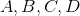
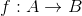
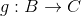
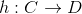
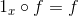

# Fonksiyonel Programlama Jargonu

## Arity

Bir fonksiyonun aldığı argüman sayısıdır. Bir fonksiyon aldığı argüman sayısına göre _unary_ (1 argüman), _binary_ (2 argüman), _ternary_ (3 argüman)... olarak adlandırılır. Eğer bir fonksiyon değişken sayıda argüman alıyorsa _variadic_ olarak adlandırılır.

```haskell
Prelude> let sum a b = a + b
Prelude> :t sum
sum :: Num a => a -> a -> a

-- sum fonksiyonunun arity'si 2dir.
```

## Higher-Order Functions (HOF)

Argüman olarak bir fonksiyon alan ya da bir fonksiyonu çıktı veren fonksiyonlardır.

```haskell
Prelude> let add3 a = a + 3
Prelude> map add3 [1..4]
[4,5,6,7]
```

```haskell
Prelude> filter (<4) [1..10]
[1,2,3]
```

## Closure

_Kapanış_, bir fonksiyona bağlı değişkenleri koruyan bir kapsamdır.
[Kısmi uygulama](#partial-application) için önemlidir.


```haskell
Prelude> let f x = (\y -> x + y)
```

`f` fonksiyonunu bir sayı ile çağıralım.

```haskell
Prelude> let g = f 5
```

Bu durumda `x = 5` değeri `g` fonksiyonunun kapanışında korunur. Şimdi `g` fonksiyonunu bir `y` değeri ile çağırırsak:

```haskell
Prelude> g 3
8
```

## Partial Application

_Kısmi uygulama_, bir fonksiyonun bazı argümanlarını önceden doldurarak yeni bir fonksiyon oluşturmaktır.

```haskell
-- Orjinal fonksiyonumuz
Prelude> let add3 a b c = a + b + c

--`2` ve `3` argümanlarını `add3` fonksiyonumuza vererek `fivePlus` fonksiyonumuzu oluşturuyoruz
Prelude> let fivePlus = add3 2 3

Prelude> fivePlus 4
9
```

Kısmi uygulama, kompleks fonksiyonlardan daha basit fonksiyonlar oluşturmaya yardım eder. [Curried](#currying) fonksiyonlar otomatik olarak kısmi uygulanmış fonksiyonlardır.

## Currying

Birden çok parametre alan bir fonksiyonu, her defasında sadece bir parametre alan bir fonksiyona dönüştürmektir.

Fonksiyon her çağrıldığında sadece bir argüman kabul eder ve tüm argümanlar verilene kadar sadece bir argüman alan bir fonksiyon döndürür.

```haskell
Prelude> let sum (a, b) = a + b
Prelude> let curriedSum = curry sum
Prelude> curriedSum 40 2
42
Prelude> let add2 = curriedSum 2
Prelude> add2 10
12

```

## Function Composition

İki farklı fonksiyonu bir araya getirerek, bir fonksiyonun çıktısı diğer fonksiyonun girdisi olan üçüncü bir fonksiyon oluşturmaktır.

```haskell
-- fonksiyonları bir araya getirmek için '.' operatörü kullanılır
Prelude> let floorAndToString = show . floor
Prelude> floorAndToString 32.123
"32"
```

## Purity

Bir fonksiyonun çıktısı sadece girdi veya girdilerine bağlı ve fonksiyon yan etki oluşturmuyor ise, fonksiyon _saftır_ denir.

```haskell
Prelude> let greet name = "Hello " ++ name
Prelude> greet "Brianne"
"Hello Brianne"
```

Saf olmayan fonksiyona bir örnek:

```haskell
Prelude> let name1 = "Brianne"
Prelude> let greet = "Hello " ++ name1
Prelude> greet
"Hello Brianne"
```

Yukarıdaki  fonksiyonun çıktısı fonksiyonun dışarısında tanımlı bir değişkene bağlıdır.

## Side effects

Bir fonksiyon veya ifade, dışarısındaki bir durum ile etkileşime geçiyor ise (okuma veya yazma), _yan etki_ ye sahiptir denir.

Haskell'deki tüm fonksiyonlar saftır.

## Idempotent

Bir fonksiyon, sonucuna tekrar uygulandığında sonuç değişmiyorsa _idempotent_ olarak adlandırılır.

```
f(f(x)) ≍ f(x)
```

```haskell
Prelude> abs (abs (-1))
1
```

```haskell
Prelude Data.List> sort (sort [1,4,3,1,5])
[1,1,3,4,5]
```

## Point-Free Style

Argümanların açıkca tanımlanmadığı fonksiyonlar yazmaktır. _Tacit programming_ olarak da bilinir.

```haskell
Prelude> let add a b = a + b

-- incrementAll fonksiyonunu tanımlayalım

-- Point-free değildir - `numbers` argümanı belirtilmiştir
Prelude> let incrementAll numbers = map (+1) numbers

-- Point-free - Fonksiyonun aldığı argüman açıkca belirtilmemiştir
Prelude> let incrementAll = map (+1)
```

`incrementAll` fonksiyonunun `numbers` argümanını aldığı belirtilmiştir, bu nedenle point-free değildir.  `incrementAll2` fonksiyonu ise, fonksiyon ve değerlerin bir bileşimidir ve argüman bilgisi belirtilmemiştir.  Yani _point-free_ dir.

## Predicate
Verilen bir değer için doğru veya yanlış değerini dönen fonksiyonlardır. Genellikle _filter_ ile beraber kullanılırlar.

```haskell
Prelude> let predicate a = a < 3
Prelude> filter predicate [1..10]
[1,2]
```

## Referential Transparency

Bir ifade değeri ile yer değiştirildiğinde programın davranışı değişmiyor ise, ifade _referentially transparent_ olarak adlandırılır.

## Lambda

Anonim (isimsiz) fonksiyonlardır.

``
\x -> x + 1
``

Çoğunlukla yüksek mertebeden fonksiyonlar ile birlikte kullanılırlar.

```haskell
Prelude> map (\x -> x + 1) [1..4]
[2,3,4,5]
```

## Lazy evaluation

_Lazy evaluation_, bir ifadenin, ifade sonucuna ihtiyaç duyulana kadar hesaplanmamasıdır. Böylece, sonsuz listeler gibi yapılar tanımlanabilir.

```haskell
Prelude> let lst0 = [1..]
Prelude> take 5 lst0
[1,2,3,4,5]
```

## Category
Bir  kategorisi üç şeyden oluşur:

 - Nesnelerin bir kümesi,
 - Her bir nesne çifti için, morfizmaların bir kümesi,
 - Birbiriyle uyumlu morfizma çiftleri arasında tanımlı bir ikili işlem.

ve aşağıdaki iki beliti sağlar:

 -  nesneler ve  morfizmalar olmak üzere, ,   ve  ise  dir,
 - Her  nesnesi ve her  ve  için,  ve  koşullarını sağlayan bir  morfizması vardır.

Aşağıdaki tabloda bir kaç kategori örneği verilmiştir.

| Kategori       | Nesneler           | Morfizmalar  |
|------------------|--------------------|----------------|
| Set  | Kümeler | Fonksiyonlar |
| Grp | Gruplar | Grup homomorfizmaları |
| Top | Topolojik uzaylar | Sürekli fonksiyonlar |
| Uni | Düzgün uzaylar | Düzgün sürekli fonksiyonlar |

### Haskell'de kategoriler

**Hask**, Haskell tiplerinin ve fonksiyonlarının bir kategorisidir.

**Hask** kategorisinin nesneleri Haskell'deki _tipler_, ```A``` nesnesinden ```B``` nesnesine tanımlı morfizmalar ise ```A -> B``` şeklindeki fonksiyonlardır. 


__Daha Fazla Kaynak__

* [Category Theory for Programmers](https://bartoszmilewski.com/2014/10/28/category-theory-for-programmers-the-preface/)

## Morphism

_Morfizma_, bir kategorideki iki nesne arasındaki eşlemedir.

1. _Homomorfizma_, aynı tipteki iki cebirsel yapı arasındaki bir eşlemedir. Morfizmanın daha genel halidir.
2. Bir kategorideki  morfizması ve bu kategorideki her  morfizmaları için  ise ```f``` morfizması _monomorfizma_ olarak adlandırılır.
3. Bir kategorideki  morfizması ve bu kategorideki her  morfizmaları için  ise ```f``` morfizması _epimorfizma_ olarak adlandırılır.
4. Birebir ve örten morfizmalar, _isomorfizma_ olarak adlandırılır.
5. Bir nesneden kendisine ve örten morfizmalar, _endomorfizma_ olarak adlandırılır.
6. Bir nesneden kendisine isomorfizmalar, _otomorfizma_ olarak adlandırılır.

## Functor

 ve  iki kategori olsun. Bir  funktoru

 -  kategorisindeki her  nesnesi için ,
 -  kategorisindeki her  ve  morfizmaları için 

koşullarını sağlayan bir eşlemedir.

### Haskell'de funktorlar

Funktor, üzerine ``map`` fonksiyonu uygulanabilen bir tiptir (listeler üzerine uygulanan map fonksiyonunu genelleştirir) ve tek bir metoda sahiptir:

```haskell
class Functor f where
    fmap :: (a -> b) -> f a -> f b
```

## Monoid


## Monad

## Comonad

## Applicative Functor


## Setoid

## Semigroup

## Foldable

## Algebraic data type

### Sum type


### Product type


## Option

---
## References
- [Haskell - Wiki](https://wiki.haskell.org/Haskell)
- [Haskell - Wikibooks](https://en.wikibooks.org/wiki/Haskell)
- [hemanth/functional-programming-jargon](https://github.com/hemanth/functional-programming-jargon).
- [Wolfram MathWorld](http://mathworld.wolfram.com)
